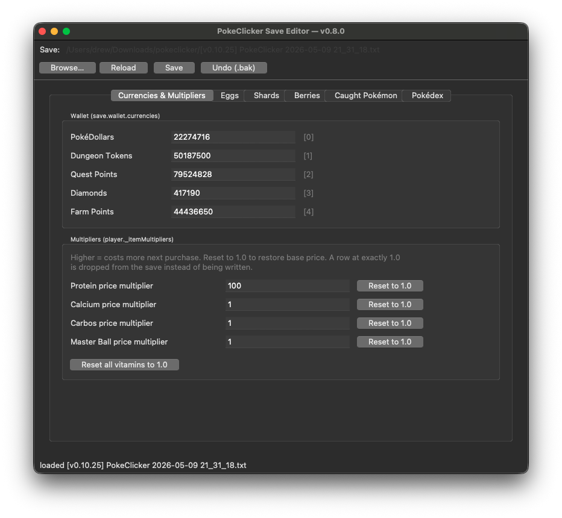

# pokeclicker-editor
USE AT YOUR OWN RISK. UNOFFICIAL, educational use only. 


A small Python CLI for inspecting and editing [PokeClicker](https://www.pokeclicker.com/) save exports. Tested against `v0.10.25`.

> **Latest release:** see <https://github.com/daclink/pokeclicker-save-editor/releases/latest>.
> Pre-built installers are attached for macOS, Windows, and Linux — see *Download & install* below.

## Download & install

| platform | file | install |
|---|---|---|
| **macOS** (Apple Silicon, Intel via Rosetta) | `PCEdit-macos.dmg` | Double-click → drag **PCEdit** to **Applications**. First launch: right-click → **Open** to bypass the *unidentified developer* prompt (the app isn't code-signed yet). |
| **Windows 10 / 11** | `PCEdit-windows.exe` | Save anywhere and double-click to run. SmartScreen may show a warning on the first launch — click **More info → Run anyway** (the binary isn't code-signed yet). |
| **Linux x86_64** (glibc-based distros) | `PCEdit-linux-x86_64.tar.gz` | `tar xzf PCEdit-linux-x86_64.tar.gz && chmod +x PCEdit-linux-x86_64 && ./PCEdit-linux-x86_64`. The tarball also contains a 256 px icon, a `.desktop` file, and a short README for optional desktop integration. |

All three downloads are at the **Assets** section of every release on the [Releases page](https://github.com/daclink/pokeclicker-save-editor/releases).

If you want the source instead of a binary, see [Build](#build).

## Save format

A PokeClicker `.txt` save export is **base64 of a JSON document**.

The JSON is *not* UTF-8 clean — strings like `"Pokémon"` are stored as Latin-1 bytes inside the JSON payload. Decoding the base64, then decoding the bytes as `latin-1`, then `json.loads` parses it. Re-serializing with no whitespace (`separators=(",", ":")`) and re-encoding as `latin-1` produces a **byte-exact** round-trip.

Top-level shape:

```
{
  "player":   { _region, _route, _townName, _itemList, ... },
  "save":     { wallet, party, badgeCase, statistics, quests, ... },
  "settings": { ... 290 UI/preference keys ... }
}
```

A few observed conventions worth knowing:

- **`save.wallet.currencies`** is positional: `[money, dungeonTokens, questPoints, diamonds, farmPoints, battlePoints]`.
- **`save.party.caughtPokemon[i]`** is a dict whose keys are integer-strings:
  - `"0"` — attack bonus from hatching (25 = first hatch tier).
  - `"1"` — pokerus state.
  - `"2"` — EVs by attack type (`{"0": n, "1": n, ...}`).
  - `"3"` — total exp.
  - `"4"` — currently in the egg/breeding list.
  - `"5"` — resistant flag.
  - Plus a regular `"id"` key for the Pokédex number.
- **`save.logbook.logs`** is a 100-entry ring buffer; almost every save has 100 differing positions because the in-game log scrolled.
- **Type drift `int ↔ float`** appears in `*.durability`, `*.timeUntilDiscovery`, etc. JS serializes whole-number floats as ints, so the same field shows as `27` or `27.0` depending on whether a tick happens to be a whole number.

## Requirements

- Python **≥ 3.10**.
- For the GUI: that Python must include the `tkinter` module (most distros ship it; bare Homebrew Python on macOS does not, see below).
- No third-party packages — pure standard library.

Verify Tk:

```sh
python3 -c "import tkinter; print('tk', tkinter.TkVersion)"
```

If that errors with `ModuleNotFoundError: No module named '_tkinter'`:

| OS | fix |
|---|---|
| macOS, Apple Silicon Homebrew | use `/opt/homebrew/bin/python3` — ships Tk 9.0. |
| macOS, Intel Homebrew | `brew install python-tk@3.13` (or whichever 3.x you use). |
| macOS, Apple's `/usr/bin/python3` | Tk requires macOS 26+; prefer a Homebrew Python. |
| Debian / Ubuntu | `sudo apt install python3-tk` |
| Fedora | `sudo dnf install python3-tkinter` |
| Windows | bundled with the installer from python.org. |

The CLI (`pcedit.py`) does **not** need Tk — only `pcedit_gui.py` does.

## Build

There is nothing to compile — this is plain Python. "Build" is just getting the code in place.

```sh
git clone <this repo> pokeclicker-editor
cd pokeclicker-editor

# sanity-check the CLI
python3 pcedit.py --help

# sanity-check the GUI (opens an empty window — close it)
python3 pcedit_gui.py
```

Optional conveniences:

```sh
# Make the scripts directly executable.
chmod +x pcedit.py pcedit_gui.py
./pcedit.py --help

# Add a shell alias so you can run from anywhere.
alias pcedit='python3 /path/to/pokeclicker-editor/pcedit.py'
alias pcedit-gui='python3 /path/to/pokeclicker-editor/pcedit_gui.py'

# Optional virtualenv. Not necessary (no deps) but harmless.
python3 -m venv .venv && source .venv/bin/activate
```

To bundle a single-file standalone GUI (no Python install required by the end user):

```sh
pip install pyinstaller
pyinstaller --onefile --windowed --name PCEdit pcedit_gui.py
# binary lands in ./dist/PCEdit  (or PCEdit.exe on Windows)
```

PyInstaller is the only step that brings in a non-stdlib dependency, and it's only needed if you want to ship a frozen binary.

## Usage

### Workflow

1. In PokeClicker, open Settings → Save → **Download Save** to get a `.txt`.
2. Run `pcedit_gui.py <save.txt>` (or use the CLI), edit, click Save.
3. The original file is copied to `<save>.txt.bak` automatically.
4. In PokeClicker, Settings → Save → **Import Save** and pick the edited `.txt`.
5. If the game refuses or behaves oddly, hit **Undo (.bak)** in the GUI (or `pcedit.py undo <save.txt>`) to roll back.

### GUI

```sh
python3 pcedit_gui.py                              # empty window, use Browse…
python3 pcedit_gui.py path/to/save.txt             # auto-load on launch
```

#### Opening a save



On first launch the window looks like the screenshot above:

1. **Row 1** of the top bar shows `Save: (no file)` — that's where the
   loaded path will appear.
2. **Row 2** has four action buttons. Only **Browse…** is enabled until a
   save is loaded; **Reload**, **Save**, and **Undo (.bak)** are greyed out
   on purpose.
3. The notebook below has five tabs (Currencies & Multipliers, Eggs,
   Shards, Caught Pokémon, Pokédex). Their fields are empty until a file
   is open.
4. The status bar at the bottom reads `open a save file to begin`.

To open a save:

1. Click **Browse…** and pick the `.txt` file PokeClicker exported
   (Settings → Save → Download Save in the game).
2. The path replaces `(no file)` in row 1, the other three buttons
   activate, every tab populates, and the status bar reads
   `loaded <filename>`.
3. From there: edit, click **Save** (the original is copied to
   `<file>.bak` automatically), and re-import the file in PokeClicker.

You can also pre-load a save by passing it on the command line:

```sh
python3 pcedit_gui.py path/to/save.txt
```

**Reload** discards any in-flight edits and re-reads the file from disk.
**Undo (.bak)** confirms, then restores the file from its backup and
re-loads — handy if a save you just wrote causes the game to misbehave.

#### Tabs

| tab | what you can change |
|---|---|
| **Currencies & Multipliers** | PokéDollars, Dungeon Tokens, Quest Points, Diamonds, Farm Points, and the **Protein price multiplier** (`player._itemMultipliers["Protein\|money"]`). Use the *Reset to 1.0* button to make vitamins cheap again. |
| **Eggs** | The breeding `eggList` (one row per slot). *Edit selected* opens a form. *Hatch now* sets `steps = totalSteps`. *Make empty* clears a slot back to `{type: -1, pokemon: 0}`. *Add egg* / *Remove* manage entries. **Quick-add** buttons drop a Grass / Fire / Water / Dragon / Mystery egg into the first empty slot (or append, bumping `eggSlots`). The `eggSlots` field above the table controls how many slots the game shows. |
| **Shards** | Counts for the 16 type-shard colors (Red/Yellow/Green/Blue, Black/Grey, Purple/Crimson, Pink/White, Cyan/Lime, Rose/Ochre, Beige/Indigo). Editing a color you haven't unlocked yet is fine — it appears once you reach the right region. Buttons set the whole grid to 999 / 9999 / 0 in one click. Any unrecognised `*_shard` items in the save show up in the "Other" panel below the grid. |
| **Caught Pokémon** | All caught pokémon, sortable by ID. The `Name` column shows the species (Kanto names today; later regions show `?` until [#4](https://github.com/daclink/pokeclicker-save-editor/issues/4) lands). Double-click a row (or *Edit selected…*) to change `atkBonus` (`.0`, increments by 25 per hatch), `pokerus` (`.1`), `exp` (`.3`), and toggle the in-egg (`.4`) and resistant (`.5`) flags. Quick-action buttons set common values without opening a dialog. |
| **Pokédex** | Region dropdown (Kanto … Paldea) over a listbox of every pokémon in that range. Caught entries are marked with `✓` and dimmed; uncaught are blank. Multi-select rows and click *Mark selected caught*, or *Mark all uncaught in region* to fill the entire region in one click. *Show uncaught only* hides the already-caught rows. New entries are minimal stubs (`{"2": {"0":0,"1":0,"2":0}, "3": 1, "id": <n>}`); the in-game capture statistics (`totalPokemonCaptured` etc.) are **not** updated, so the Trainer Card numbers won't move even though the pokémon will appear caught in the dex. |

The status bar at the bottom of the window shows what just happened
(`loaded …`, `saved …`, `restored …`, etc.).

The status bar at the bottom shows what just happened.

### CLI

```sh
python3 pcedit.py <command> <save.txt> [args]
```

Reference:

| command | description |
|---|---|
| `summary <save>` | One-screen snapshot: location, badges, money, play time, etc. |
| `decode <save> [-o out.json]` | Base64 save → pretty JSON. |
| `encode <json> [-o out.txt]` | Pretty JSON → base64 save. |
| `dump <save> [-o out.json]` | Alias for `decode`. |
| `get <save> <path>` | Read any field by [path](#path-syntax). |
| `set <save> <path> <value> [-o out]` | Write any field. Value parsed as JSON literal first, then scalar. |
| `money <save> <amount> [--add]` | Set/add PokéDollars (`currencies[0]`). |
| `tokens <save> <amount> [--add]` | Set/add Dungeon Tokens (`currencies[1]`). |
| `quest-points <save> <amount> [--add]` | Set/add Quest Points (`currencies[2]`). |
| `farm-points <save> <amount> [--add]` | Set/add Farm Points (`currencies[4]`). |
| `give <save> <item> <amount> [--set]` | Add (or `--set`) an inventory item count in `player._itemList`. |
| `keyitem <save> <name> [--off]` | Toggle a key item under `save.keyItems`. |
| `berry <save> <index> [--off]` | Unlock/lock a berry by index. |
| `caught <save>` | Print a table of caught pokémon (id, atkBonus, pokerus, exp, flags). |
| `undo <save>` | Restore the file from its `.bak`. |

All write commands take `-o <new-path>` to leave the original alone. Otherwise the original is copied to `<file>.bak` and overwritten in place.

#### Examples

```sh
# Inspect
python3 pcedit.py summary save.txt
python3 pcedit.py decode  save.txt -o save.json
python3 pcedit.py get     save.txt save.statistics.totalMoney
python3 pcedit.py get     save.txt 'save.party.caughtPokemon[id=25]'

# Currencies
python3 pcedit.py money        save.txt 9999999
python3 pcedit.py tokens       save.txt 1000000 --add
python3 pcedit.py quest-points save.txt 50000
python3 pcedit.py farm-points  save.txt 10000

# Diamonds (no shortcut — use raw set)
python3 pcedit.py set save.txt 'save.wallet.currencies[3]' 500

# Protein price multiplier
python3 pcedit.py set save.txt 'player._itemMultipliers.Protein|money' 1.0

# Inventory (shards live here too)
python3 pcedit.py give save.txt Pokeball     100
python3 pcedit.py give save.txt Lucky_egg     50 --set
python3 pcedit.py give save.txt Yellow_shard 999
python3 pcedit.py give save.txt Pink_shard   500 --set

# Eggs (manipulate the array directly)
python3 pcedit.py get save.txt 'save.breeding.eggList[0]'
python3 pcedit.py set save.txt 'save.breeding.eggList[0].steps' 1200   # hatch slot 0

# Pokémon edits
python3 pcedit.py set save.txt 'save.party.caughtPokemon[id=25].3' 1000000   # exp
python3 pcedit.py set save.txt 'save.party.caughtPokemon[id=25].5' true       # resistant

# Key items / berries / quests
python3 pcedit.py keyitem save.txt Explorer_kit
python3 pcedit.py keyitem save.txt Holo_caster --off
python3 pcedit.py berry   save.txt 0
python3 pcedit.py set     save.txt save.quests.xp 99999

# Recover
python3 pcedit.py undo save.txt
```

### Library

```python
from pokeclicker_save import decode_file, encode_file, get_path, set_path

data = decode_file("save.txt")
print(get_path(data, "save.statistics.totalMoney"))
set_path(data, "save.wallet.currencies[0]", 1_000_000)
encode_file(data, "save.txt")
```

`decode_file` / `encode_file` operate on filesystem paths. `decode_bytes` / `encode_bytes` operate on raw base64 bytes if you'd rather pipe data through.

## Path syntax

The `get`/`set` commands accept dot-separated paths with two extras:

| form | meaning |
|---|---|
| `a.b.c` | nested keys |
| `a[3]` | list index |
| `a[id=25]` | first dict in list whose `id` field equals `25` (ints/floats/strings supported) |

The `[k=v]` form also matches by `name`, `region`, `berry`, etc. — anything stable inside the list.

## Safety

- `set` and the convenience commands write to the original file by default, **after copying it to `<file>.bak`**. Use `-o new_save.txt` to write to a new file instead.
- Round-trip is byte-exact for unmodified saves — verified with the test cases this repo was developed against.
- The tool does **not** validate game logic. You can hand the game a Pokédex entry it doesn't expect, and the game may crash or sanitize it on the next save. Edit small things first, save in-game, and confirm before going wild.
- This is for tinkering with your own local save. Don't use it for cheating online leaderboards (PokeClicker is single-player but be a good neighbor).

## Releasing

Releases are driven from `CHANGELOG.md` (Keep a Changelog format) so the
notes on the GitHub Releases page are exactly what's checked into the repo.
Native installers are built by GitHub Actions
([`.github/workflows/release.yml`](.github/workflows/release.yml)) on every
push to a release branch.

The flow:

1. **Cut a release branch** off `main`:

   ```sh
   git checkout main && git pull
   git checkout -b release/v0.4.0
   git push -u origin release/v0.4.0
   ```

   Pushing to a branch that matches `release/**` triggers the **Build
   installers** workflow. The macOS `.dmg` shows up as a downloadable
   artefact on the run page. Each subsequent push to the same branch
   re-runs the build — iterate on it as much as you need before tagging.

2. **Promote `[Unreleased]` to `[X.Y.Z] — YYYY-MM-DD`** in `CHANGELOG.md`,
   add the compare-link reference at the bottom, and update `[Unreleased]`
   to compare against the new tag.

3. **Open a PR from the release branch into `main`.** Review the
   workflow-built `.dmg` from the latest run, hit Merge.

4. **Cut the release with the helper:**

   ```sh
   # Preview the notes without publishing or tagging.
   python3 scripts/release.py X.Y.Z --dry-run

   # Tag, push, and create the GitHub release. Notes come straight out of
   # CHANGELOG.md plus a header (tag, date, "tested against PokeClicker vN.M").
   python3 scripts/release.py X.Y.Z
   ```

   The same workflow re-fires on the tag push and **uploads the `.dmg`
   directly to the GitHub Release** the script just created.

   If the tag already exists (e.g. you're filling in notes for a release
   that was tagged manually), pass `--skip-tag`. Pre-releases use
   `--prerelease`.

The release helper is stdlib-only and shells out to `git` and `gh`, so it
works on any machine with both installed and `gh auth status` configured.

### Building installers locally

Each builder is a separate script and must run on its target OS. All three
auto-install PyInstaller via `pip` if missing, and assume Tk is present
(see [Requirements](#requirements)).

```sh
# macOS (.app bundle + .dmg drag-to-Applications installer)
python3 scripts/build_macos.py
# → dist/PCEdit.app
# → dist/PCEdit-macos.dmg     ~12 MB

# Windows (single .exe)
python scripts/build_windows.py
# → dist\PCEdit-windows.exe

# Linux (single ELF + tarball with icon, .desktop, README)
python3 scripts/build_linux.py
# → dist/PCEdit-linux-x86_64
# → dist/PCEdit-linux-x86_64.tar.gz
```

The macOS builder defaults to `--target-arch universal2` and falls back to
the native arch when the building Python isn't universal2-capable.

### Regenerating the app icon

The app-icon files (`assets/icon/PCEdit.icns`, `PCEdit.ico`,
`PCEdit-256.png`, `PCEdit-512.png`) are checked into the repo so CI doesn't
need ImageMagick. If you edit `assets/icon/pokeball.svg`, regenerate them:

```sh
python3 scripts/make_icons.py
```

Requires `magick` (ImageMagick) plus `iconutil` (macOS, built-in) to
rebuild the `.icns`. The source SVG is the Pokéball icon from
[pokeclicker.com](https://www.pokeclicker.com/), used unmodified.

## Repo layout

```
pokeclicker_save.py   format library (decode, encode, path get/set)
pokeclicker_data.py   static reference data (region ranges, Kanto names)
pcedit.py             CLI entry point
pcedit_gui.py         Tk GUI editor
scripts/release.py    CHANGELOG-driven release helper (gh wrapper)
scripts/build_macos.py   PyInstaller .app + .dmg builder (run on macOS)
scripts/build_windows.py PyInstaller .exe builder (run on Windows)
scripts/build_linux.py   PyInstaller ELF + tarball builder (run on Linux)
scripts/make_icons.py    Rebuild assets/icon/* from pokeball.svg
.github/workflows/    CI: build installers on push to release/** and tag
assets/icon/          Source SVG and pre-rendered .icns / .ico / PNGs
screenshots/          README images
CHANGELOG.md          Keep a Changelog history; canonical release notes
README.md             this file
LICENSE               CC0 1.0
.gitignore
```

## Roadmap

Tracking, in rough priority:

- [ ] **Platform installers.** Ship pre-built single-file binaries so end-users don't need a Python install:
  - macOS: `pyinstaller --onefile --windowed` → `.app` bundle, packaged into a signed `.dmg`.
  - Windows: same `pyinstaller` invocation → `.exe`, optionally wrapped in an MSI via `wix`.
  - Linux: AppImage (via `python-appimage`) or a `.deb` for Ubuntu/Debian.
  - CI workflow that builds all three on tag push and attaches them to the GitHub release.
- [ ] **Pokédex names beyond Kanto.** Currently `pokeclicker_data.py` has only Kanto names; later regions show ID numbers without a friendly name. Embedding the full national-dex roster (~1025 entries) is one option; pulling from a small data file at startup is another.
- [ ] **Pokédex stat back-fill.** When marking pokémon caught from the Pokédex tab, also bump `save.statistics.totalPokemonCaptured` and per-id capture counts so the Trainer Card numbers match.
- [ ] **Schema diff for new game versions.** A fixture-driven test that decodes saves from each minor version and asserts the editor's known-keys still resolve, so we notice when v0.10.26 (etc.) shifts something.
